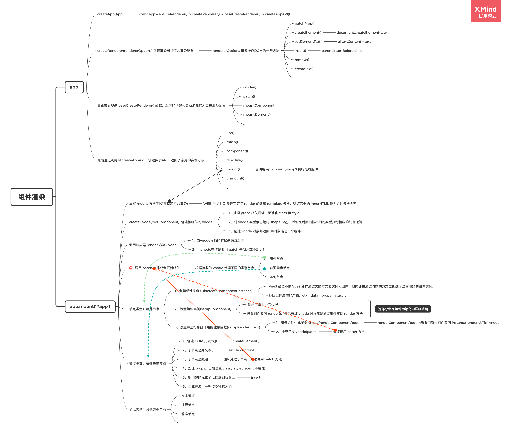
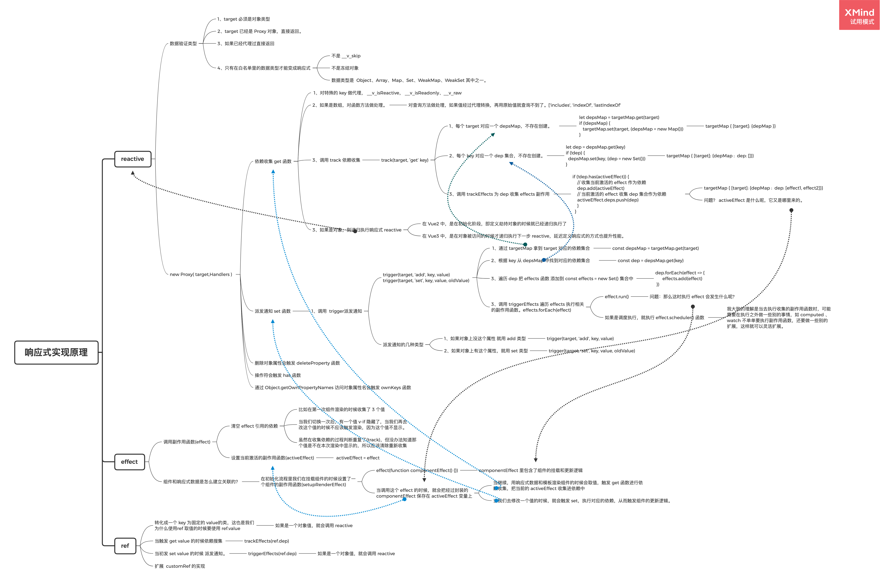

# vnext-analysis

此项目是在研究 Vue3 体系的源码分析的总结记录。现有 200+ 流程标记、20+ 思维导图、2+ Mini 版实现。

### 体系进度

- [x] Vue 3.2.0
- [x] Vue-Router 4.0.0
- [ ] Vuex
- [ ] Pinia

### 流程标记

我一直想把流程调试过程中的主要断点保存下来，以便后续再次看的时候能轻松的找到不过没找到方案。现在使用了 `VsCode` 的 [Todo Tree](https://marketplace.visualstudio.com/items?itemName=Gruntfuggly.todo-tree) 符合心中的预期，能高亮、能过滤、能搜索，如果需要调试就在浏览器对应的位置打上断点。

为什么给每个主要流程打上标记，因为在这么大的源码库里方法和文件来回跳转很正常不过了。如果这样就可以根据打的标记走，在研究分支细节的时候也能轻松回到主流程。

### 测试例子

如果调试测试例子是必不可少，所有都写了简单的用例。因为编译原理我没有深入研究只是理解了编译过程，所以我大部分都是先写 `template` 的方式测试，然后通过 [template-explorer](https://vue-next-template-explorer.netlify.app/) 编译，再根据编译结果手写 `render` 的方式实现。

### 思维导图

在理解完一个功能实现后，都会重新梳理流程，把重要的点和调用关系图用思维导图的方式呈现出来用于加强理解。

### Mini 版本

理解核心功能，实现简易的版本实现，目前实现了两个 _响应式原理_ 和 _DIFF 算法原理_。

### 参考资料

感谢所有社区优秀资源的贡献者们。

<https://ustbhuangyi.github.io/vue-analysis/v3/new/>
